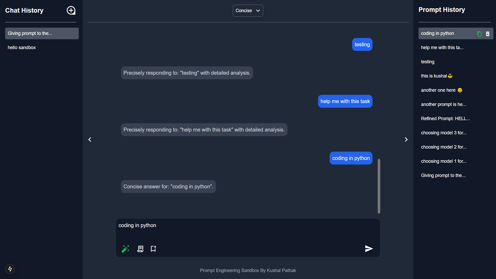
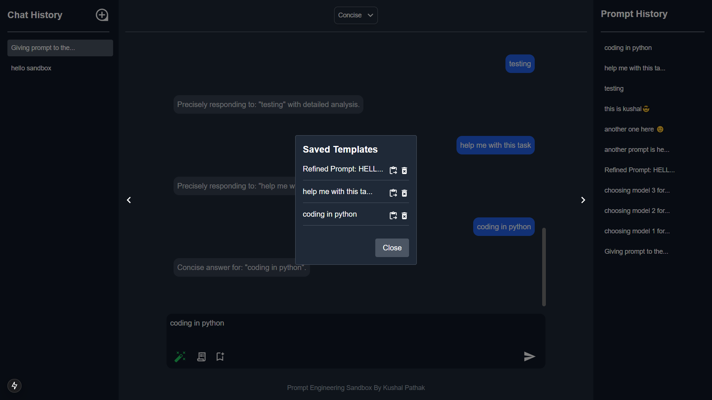

# Prompt Engineering Sandbox

## Overview

This web app allows the user to try AI prompts. The user can type a question or command, choose a model (such as Creative, Precise, or Concise), and then see a fake AI answer that appears with a typing effect.

## Design Choices and UI/UX

- **Simple and Easy:**  
  The design is very simple so that any user can use it without much confusion.

- **Dark Look:**  
  The app uses dark colors which are good for the eyes, especially in a dark room.

- **Fast Feedback:**  
  When the user sends a prompt, the app shows "Loading..." quickly and then the answer appears as if it is being typed.

- **Keyboard Use:**  
  The user can press Enter to send a prompt (and if Shift+Enter is used, a new line is created).

## Component Structure and State Management

- **Components:**

  - **Header:**  
    This section displays the dropdown to choose the AI model.
  - **ChatArea:**  
    This area displays the messages from the user and the AI.
  - **PromptArea:**  
    This section is where the user types a prompt and clicks the button to send it.
  - **Footer:**  
    A simple footer that shows extra information.

- **State Management:**
  - The main page keeps track of the text the user types, the chat messages, whether the app is busy (loading), and which AI model is selected.
  - A small trick using a reference is used to know which message to update when showing the typing animation.

## Challenges Faced

- **Typing Animation:**  
  It was difficult to make the AI answer appear as if it is being typed. A timer was used to add one letter at a time.

- **Error Messages:**  
  It was a bit challenging to display error messages clearly when nothing is typed or when there is an error in the API.

- **Responsive Design:**  
  Efforts were made to ensure the app looks good on phones, tablets, laptops, and desktops by adjusting the container size.

## Future Ideas and Improvements

- **Chat Management:**  
  Add features to create new chats, store chat history, and allow users to delete chats.

- **Search Functionality:**  
  In the future, add the ability to search old chats.

- **Prompt History:**  
  Store prompt history for each chat and allow users to copy, use, or delete prompts.

- **AI Response Actions:**  
  Add an option to copy the AI response.

- **Prompt Refinement:**  
  Include a button to refine prompts before running, which provides refined prompt suggestions.

- **Template Management:**  
  Add features for saving, using, deleting, editing, and exporting prompt templates.

- **Voice Input:**  
  Also add voice input so that users can speak their prompts.

- **File Upload:**  
  In the future, add the ability to upload files.

- **Dark/Light Mode:**  
  In the future, add the ability to switch between dark and light mode.

  ##Future looks
  
  


## How to Run the App

1. **Clone the Repository:**

   ```bash
   git clone git@github.com:Kushal-Pathak/prompt-engineering-sandbox.git
   ```

2. **Switch to project directory:**

   ```bash
   cd prompt-engineering-sandbox
   ```

3. **Install dependencies:**
   ```bash
   npm install
   ```
4. **Run the local server:**
   ```bash
   npm run dev
   ```
5. **Lookup in browser:**
   ```bash
   localhost:3000
   ```
